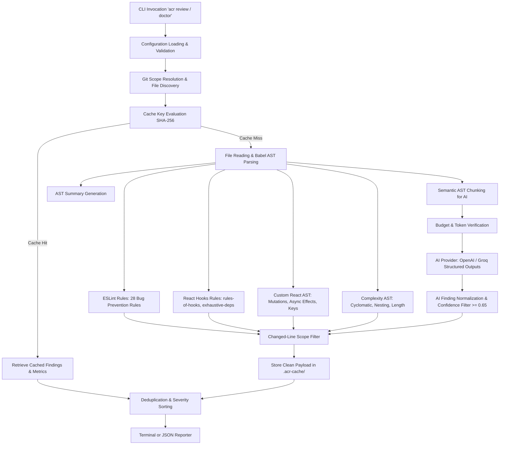

# Learning Journal: Autonomous Code Reviewer (ACR)

A deep-dive technical journal and architectural breakdown of **ACR (`@debdipbhat/acr`)**, a terminal-first, production-grade static analysis and AI-powered JavaScript & React code reviewer.

---

## Table of Contents

1. [Executive Overview & Philosophy](#1-executive-overview--philosophy)
2. [High-Level Architecture & Pipeline](#2-high-level-architecture--pipeline)
3. [Deep-Dive Subsystem Breakdown](#3-deep-dive-subsystem-breakdown)
   - [3.1 CLI & Command Layer (`bin/`, `src/cli/`)](#31-cli--command-layer-bin-srccli)
   - [3.2 Configuration Engine (`src/config/`)](#32-configuration-engine-srcconfig)
   - [3.3 File Scanner & Git Integration (`src/scanner/`)](#33-file-scanner--git-integration-srcscanner)
   - [3.4 AST Parser & Summarizer (`src/parser/`)](#34-ast-parser--summarizer-srcparser)
   - [3.5 Deterministic Analyzers (`src/analyzers/`)](#35-deterministic-analyzers-srcanalyzers)
   - [3.6 Review Engine & Normalization (`src/review/`)](#36-review-engine--normalization-srcreview)
   - [3.7 AI Review Engine (`src/ai/`)](#37-ai-review-engine-srcai)
   - [3.8 Content-Addressed Caching (`src/cache/`)](#38-content-addressed-caching-srccache)
4. [Execution Workflows & Use Cases](#4-execution-workflows--use-cases)
5. [Reliability, Security & Performance Patterns](#5-reliability-security--performance-patterns)
6. [Testing Strategy & CI/CD Pipeline](#6-testing-strategy--cicd-pipeline)
7. [Key Lessons & Developer Takeaways](#7-key-lessons--developer-takeaways)

---

## 1. Executive Overview & Philosophy

**ACR (`acr`)** is an automated code review engine designed for JavaScript (`.js`, `.mjs`, `.cjs`) and React JSX (`.jsx`) projects. It bridges the gap between fast, deterministic linters and contextual LLM insights.

### Core Design Principles

| Principle | Implementation |
| :--- | :--- |
| **Zero Source Modification** | Operates strictly in read-only mode (`fix: false`). It never rewrites code or alters git working trees. |
| **Deterministic First** | Static analysis (ESLint, AST complexity, React rules) runs locally with zero network overhead. |
| **Targeted AI Review (Opt-In)** | AI review is disabled by default. When enabled, it inspects semantic AST chunks rather than entire files to maximize token efficiency. |
| **Bring Your Own Key (BYOK)** | Supports OpenAI and Groq directly using environment variables (`OPENAI_API_KEY`, `GROQ_API_KEY`). API keys are never stored on disk or logged. |
| **Content-Addressed Caching** | Computes SHA-256 keys of file contents, configuration, and git scope to deliver instant incremental reviews. |
| **Git & Line-Aware Scope** | Pinpoints exact diff hunks via `--changed` and `--base <ref>`, filtering findings down to newly modified lines while preserving full AST context. |
| **Graceful Interruption** | Listens for `SIGINT`/`SIGTERM` via `AbortController`, terminating child processes and network calls cleanly with exit code `130`. |

---

## 2. High-Level Architecture & Pipeline

The pipeline follows a synchronous-looking asynchronous flow orchestrating 13 distinct phases:



---

## 3. Deep-Dive Subsystem Breakdown

### 3.1 CLI & Command Layer (`bin/`, `src/cli/`)

- **Entry Point (`bin/cli.js`)**: Instantiates Commander, registers global `AbortController`, attaches `SIGINT`/`SIGTERM` handlers, and catches top-level errors.
- **Commands**:
  - `acr review [path]`: Core review action supporting `--changed`, `--base`, `--severity`, `--ai`, `--model`, `--max-ai-cost`, `--format json`, `--no-cache`, and `--debug`.
  - `acr doctor [path]`: 8-step pre-flight environment check (Node >= 20, package integrity, root folder access, config validity, git binary & repo detection, cache directory safety, and API key availability).
  - `acr init`: Scaffolds `.acrrc.json` with safe defaults.
  - `acr cache clear`: Prunes `.acr-cache/` safely within project boundaries.
- **Reporting (`src/cli/output/`)**:
  - `terminal.js`: Formats color-coded banners, findings by file, rule IDs, code snippets, suggestions, summary breakdowns, and monotonic runtimes (`performance.now()`).
  - `json.js`: Generates machine-readable output conforming to the review schema for CI/CD integration.

### 3.2 Configuration Engine (`src/config/`)

- **Defaults (`defaults.js`)**: Deep-frozen immutable object containing default globs, exclusions, concurrency limits, analyzer thresholds, cache limits, and AI options.
- **Loading & Merging (`load-config.js`)**:
  - Traverses directory hierarchy to locate `.acrrc.json`.
  - Validates syntax and types using **Zod schema validation**.
  - Merges CLI flags on top of configuration file settings on top of defaults.

### 3.3 File Scanner & Git Integration (`src/scanner/`)

- **Discovery (`discover-files.js`)**: Uses `fast-glob` to match files based on `include` and `exclude` globs, filtering out files exceeding `maxFileSizeKb` (default 150KB) and bounding discovery to `maxFiles`.
- **Ignore Rules (`ignore-files.js`)**: Parses `.gitignore` and `.acrignore` using the `ignore` library.
- **Git Diff Engine (`git-diff.js`)**:
  - Executes read-only git commands via `child_process.execFile` with argument arrays (avoiding shell injection).
  - Discovers working tree changes (staged, unstaged, untracked via `git diff HEAD` and `git ls-files --others`).
  - Supports base-branch comparisons via `git merge-base <ref> HEAD` followed by `git diff --unified=0`.
  - Parses hunk headers `@@ -oldStart,oldCount +newStart,newCount @@` using regex, sorting and coalescing contiguous changed line intervals.

### 3.4 AST Parser & Summarizer (`src/parser/`)

- **Parser (`parse-javascript.js`, `parse-file.js`)**: Uses `@babel/parser` with full ECMAScript latest and JSX plugin support in `unambiguous` source type mode.
- **AST Summarizer (`summarize-ast.js`)**: Walks the AST to extract:
  - Top-level and named imports/exports.
  - Declared function names, line numbers, and parameter lists.
  - Class declarations and component candidates.
  - JSX presence and top-level comment blocks.

### 3.5 Deterministic Analyzers (`src/analyzers/`)

#### A. ESLint Static Analyzer (`eslint-analyzer.js`)
Uses the modern ESLint Flat Config API programmatically in memory (zero filesystem config required):
- Evaluates 28 essential bug-prevention rules (e.g., `no-undef`, `no-unreachable`, `no-dupe-keys`, `no-cond-assign`, `eqeqeq`, `no-unused-vars`).
- Injects `eslint-plugin-react-hooks` to enforce `react-hooks/rules-of-hooks` (severity `high`) and `react-hooks/exhaustive-deps` (severity `medium`).

#### B. AST Complexity Analyzer (`complexity-analyzer.js`)
Custom AST visitor evaluating functions without executing code:
- **Function Physical Line Length**: Flags functions exceeding `maxFunctionLines` (default 80).
- **Parameter Count**: Flags functions exceeding `maxParameters` (default 5), properly counting rest parameters and destructured objects.
- **Cyclomatic Complexity**: Measures decision branches (`if`, `? :`, `for`, `while`, `do-while`, `catch`, `case` with non-null test, `&&`, `||`, `??`). Flags scores exceeding `maxCyclomaticComplexity` (default 10).
- **Decision Nesting Depth**: Calculates maximum control flow depth without double-counting `else if` ladders or `try/catch` pairs. Flags depth exceeding `maxNestingDepth` (default 4).

#### C. React AST Analyzer (`react-analyzer.js`)
Inspects component lifecycles and idioms:
- **`react/component-too-large`**: Identifies oversized functional or class components (> 200 lines).
- **`react/direct-state-mutation`**: Detects direct mutations to `useState` bindings via array mutators (`.push()`, `.splice()`, `.sort()`), direct indexed assignments (`items[0] = x`), or increments (`count++`).
- **`react/async-effect-callback`**: Flags `useEffect(async () => ...)` patterns because async functions return Promises rather than clean-up disposers.
- **`react/effect-too-large`**: Flags inline effect callbacks exceeding 50 lines.
- **`react/array-index-key`**: Flags mapping loops assigning array indices directly to JSX `key` props.

### 3.6 Review Engine & Normalization (`src/review/`)

- **Finding Schema (`finding.js`)**: Strict Zod contract standardizing every finding across deterministic and AI sources:
  ```ts
  interface Finding {
    source: 'eslint' | 'complexity' | 'react' | 'ai';
    ruleId: string;
    severity: 'low' | 'medium' | 'high' | 'critical';
    category: 'correctness' | 'security' | 'performance' | 'maintainability';
    title: string;
    message: string;
    relativePath: string;
    lineStart: number;
    columnStart: number;
    lineEnd: number;
    columnEnd: number;
    suggestion: string | null;
    fixable: boolean;
    confidence?: number;
  }
  ```
- **Deduplication (`deduplicate.js`)**: Generates stable composite keys `source:ruleId:relativePath:lineStart:columnStart:lineEnd:columnEnd` to eliminate duplicate findings.
- **Severity Ranking (`severity.js`)**: Defines priority `critical (3) > high (2) > medium (1) > low (0)` and provides filtering helpers.
- **Scope Filtering (`filter-by-scope.js`)**: Restricts reported findings to lines intersecting Git diff hunks.
- **Review Orchestrator (`review-engine.js`)**: Coordinates file reads, caching, parallel parsing with bounded concurrency (`mapConcurrent`), analyzer runs, AI dispatch, aggregation, and monotonic timing measurement.

### 3.7 AI Review Engine (`src/ai/`)

- **Semantic Chunker (`chunker.js`)**:
  - Splits files into top-level functions, classes, and exported components rather than arbitrary character slices.
  - Automatically attaches file imports to each chunk for context.
  - Uses conservative token estimation (3 characters per token) with a 12,000-token per chunk guardrail.
- **Provider Layer (`provider.js`, `openai-provider.js`)**:
  - Implements an OpenAI-compatible interface supporting **OpenAI** (e.g. `gpt-5.6-luna`) and **Groq** (e.g. `openai/gpt-oss-120b`).
  - Utilizes OpenAI Structured Outputs (`response_format: { type: 'json_object' }` with strict JSON schema).
  - Handles network retries with exponential backoff and timeout enforcement.
- **Budget & Cost Tracking (`budget.js`)**:
  - Maintains versioned pricing tables for known models.
  - Checks pre-request token estimations and enforces hard ceilings on total spend (`maxEstimatedCostUsd`) and total requests (`maxRequests`).
- **Response Validation (`response-schema.js`)**:
  - Validates LLM responses via Zod schemas.
  - Rejects hallucinated findings whose line numbers fall outside the chunk boundary.
  - Discards findings below confidence threshold `0.65`.

### 3.8 Content-Addressed Caching (`src/cache/`)

- **Cache Key Formula (`cache-key.js`)**:
  $$\text{Key} = \text{SHA-256}\Big(\text{stableStringify}\big(\text{SHA-256}(\text{source}), \text{path}, \text{scope}, \text{pkgVersion}, \text{analyzersConfig}, \text{aiConfig}\big)\Big)$$
- **Security & Sandboxing (`file-cache.js`)**:
  - Rejects absolute paths or `..` directory traversal in cache directory configurations.
  - Sanitizes cached entries to ensure source code, raw ASTs, and API credentials are never written to disk.
  - Performs atomic disk writes (`tempFile` + `fs.rename`) and LRU entry eviction when exceeding `maxEntries` (default 1000).

---

## 4. Execution Workflows & Use Cases

### Workflow A: Full Repository Deterministic Review
```bash
npx acr review .
```
1. Scans project files excluding `node_modules`, `dist`, `.next`, etc.
2. Checks `.acr-cache/` for existing SHA-256 hits.
3. Parses modified/un-cached files into Babel ASTs.
4. Executes ESLint, Complexity, and React rules in parallel.
5. Emits color-coded terminal report with findings categorized by severity.
6. Returns exit code `0` (clean) or `1` (findings at or above medium severity).

### Workflow B: Fast Git PR / Pre-Commit Incremental Review
```bash
npx acr review . --changed --base origin/main
```
1. Queries `git merge-base origin/main HEAD` and inspects diff hunks.
2. Narrows file discovery strictly to modified, added, or renamed files.
3. Runs deterministic rules on full ASTs to maintain scope awareness.
4. Filters emitted findings to lines touched in the diff.

### Workflow C: Hybrid Deterministic + AI Deep Review
```bash
export GROQ_API_KEY="gsk_..."
npx acr review . --changed --ai --model openai/gpt-oss-120b --max-ai-cost 0.10
```
1. Prints transparency banner detailing provider, model, eligible files, and budget ceiling.
2. Executes deterministic analyzers first.
3. Partitions changed files into semantic function/component chunks.
4. Dispatches chunks to AI provider concurrently within token budgets.
5. Validates structured responses, filters by confidence ($\ge 0.65$), and renders combined deterministic + AI report.

### Workflow D: CI Pipeline Automation
```bash
npx acr review . --format json --severity high > review-results.json
```
1. Runs full review emitting machine-readable JSON.
2. Returns exit code `1` if any `high` or `critical` severity issues exist, failing the CI build.
3. Returns exit code `2` if fatal syntax errors or broken configurations are encountered.

---

## 5. Reliability, Security & Performance Patterns

### 1. Zero Shell Injection Vulnerabilities
All external child processes (`git`) use `child_process.execFile` with explicit argument arrays rather than `exec` with string interpolation.

### 2. Isolated ESLint Flat Configuration
ESLint rules are loaded and configured directly in Node.js memory without reading from or mutating user project ESLint configuration files.

### 3. Bounded Concurrency
All asynchronous iterations (file processing, AI requests) utilize `mapConcurrent` worker pools with configurable concurrency (default `2`, max `10`), avoiding event loop starvation and socket exhaustion.

### 4. Deterministic State Machines
Cache keys and JSON serializations use recursive key-sorting (`stableStringify`) to guarantee identical hashes across environments and operating systems.

### 5. Standardized Exit Codes

| Code | Constant | Meaning |
| :---: | :--- | :--- |
| **`0`** | `EXIT_CODES.SUCCESS` | All files analyzed successfully; no findings met or exceeded the severity threshold. |
| **`1`** | `EXIT_CODES.FINDINGS` | Review threshold triggered (at least one finding met or exceeded configured severity). |
| **`2`** | `EXIT_CODES.EXECUTION_ERROR` | Fatal configuration error, unparseable syntax, missing required API key, or budget ceiling reached. |
| **`130`** | `EXIT_CODES.INTERRUPTED` | Execution cancelled cleanly via `SIGINT` (Ctrl+C) or `SIGTERM`. |

---

## 6. Testing Strategy & CI/CD Pipeline

The test suite is built on **Vitest 3.0** and organized into three testing tiers:

```
tests/
├── unit/               # 24 unit test suites covering every submodule
│   ├── ai-budget.test.js
│   ├── ai-chunker.test.js
│   ├── complexity-analyzer.test.js
│   ├── discover-files.test.js
│   ├── eslint-analyzer.test.js
│   ├── git-diff.test.js
│   ├── load-config.test.js
│   ├── react-analyzer.test.js
│   └── ...
├── integration/        # CLI commands, argument flags, exit codes, output formats
│   └── cli.test.js
├── e2e/                # End-to-end repository reviews & mock AI workflows
│   ├── e2e.test.js
│   └── mock-ai.test.js
└── fixtures/           # Real test codebases with intentional issues
    ├── clean/
    ├── complexity-problems/
    ├── javascript-problems/
    └── react-problems/
```

### Pre-Release & Packaging Validation
- `scripts/release-check.js`: Verifies `package.json` fields, ESM exports, Node engines (`>=20`), CLI shebang (`#!/usr/bin/env node`), and file bundle manifests.
- `scripts/test-package.js`: Packages an npm tarball (`npm pack`) and executes smoke tests in an isolated temporary directory.
- `.github/workflows/ci.yml`: Executes test matrix across Node.js `20.x`, `22.x`, `24.x` on both `ubuntu-latest` and `windows-latest`.

---

## 7. Key Lessons & Developer Takeaways

1. **AST Chunking Beats Naive Token Slicing**:
   Splitting source code by syntactic boundaries (functions, classes, components) while retaining file imports provides the AI with complete semantic context, drastically reducing hallucinations.

2. **Defense-in-Depth with Structured Outputs**:
   Relying on LLMs for line numbers often leads to drift. Validating AI findings against chunk boundaries, discarding out-of-range line numbers, and enforcing a minimum confidence threshold ($\ge 0.65$) ensures high signal-to-noise ratios.

3. **Incremental Git-Aware Analysis is Essential for Speed**:
   Developers resist slow tools. Analyzing only changed lines in PRs turns a multi-minute full-repo scan into a sub-second check.

4. **Pure Programmatic Core with CLI Wrapper**:
   Structuring the core engine as pure ESM library functions in `src/index.js` with zero import side-effects allows ACR to be consumed both as a standalone CLI and as a library in custom Node.js automation scripts.
